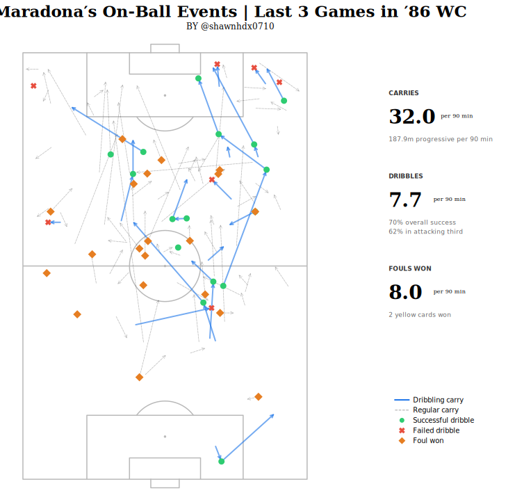
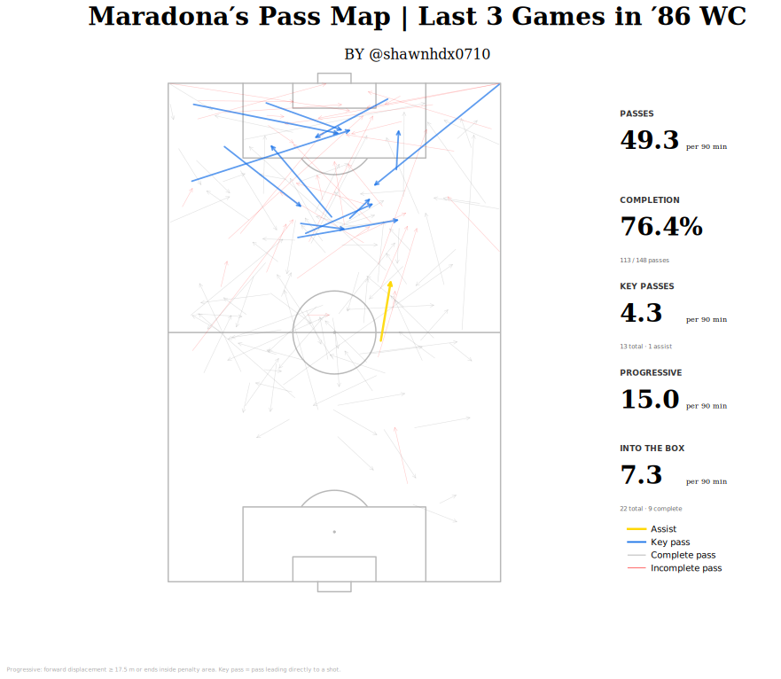
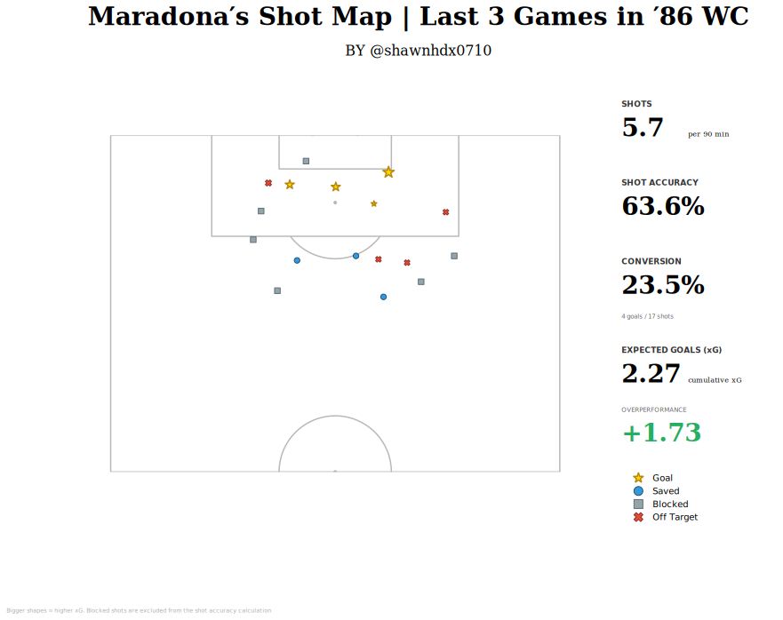

40 years later, as the World Cup returns to the Estadio Azteca, the older fans remember that distant summer when Diego Armando Maradona showed his pure divinity.

In this one of the most exhilarating journeys in football history, we will relive three defining matches: the quarter-final against England, the semi-final against Belgium, and the final against Germany.

## Overview

Argentina's head coach Carlos Bilardo invented a brand‑new tactical system in this tournament - the *first* 3‑5‑2 formation ever seen in football history. However, this primitive 3‑5‑2 has no wing‑back as we understand it today. Its core could be summed up by Bill Shankly's famous quote: "Football is like a piano. You need 8 men to carry it and 3 to play the damn thing."

The three who played the piano were: the advanced forward – Valdano; the free roaming No.10 - Maradona; and the right‑leaning, technical attacking midfielder – Burruchaga. The eight who carried the piano were: the tenacious defensive midfielder Batista and the central midfielder Enrique; the hard‑running left and right midfielders Olarticoechea and Giusti; the libero Brown; the stoppers Cuciuffo and Ruggeri; and the goalkeeper Pumpido.

Bilardo sacrificed width in attacks in exchange for the deep‑lying defensive line. As shown in this scene below against Belgium, facing a long goal kick from the Belgian side, Argentina quickly settled into a clear 3‑4 defensive shape. Batista dropped between the midfield and defensive lines to provide cover, while the two wide midfielders tucked deep inside to encircle Belgium’s attacking line.

Meanwhile, the three pianists have an enormous degree of freedom. In attack, Burruchaga would aggressively push forward to fill the void left by Maradona. Maradona has only one job: *unleash his attacking genius to the fullest*. 

## Positioning

From the heatmap, we can see that Maradona's positioning and range of movement were by no means limited to the roles we blindly assign him based on modern football concepts, such as a "wide playmaker" or a "false nine." What is worth noting is that his range of movement not only covered the 30‑meter zones across the opponent's left half‑space, central midfield, and right half‑space, but also frequently dropped deep into his own team's No.8 or even No.6 positions, where he fully controlled and orchestrated possession, or advanced when necessary.

At least based on these three match samples, Maradona can almost only be described as *an attacking free‑role player*. Whenever the team needed it, he could perfectly execute the tasks of an inside‑cutting winger, a ball‑carrying central midfielder, a traditional No.10, or an advanced striker.

## Progression

Maradona is the most formidable one-on-one player in football history. His dribbling didn't even need to start from the wing with an inside cut. Instead, he could receive the ball in a relatively central area, then drive directly forward, relying on his tank-like 168 cm and 70 kg frame to bulldoze through. When he got going, perhaps the best description came from Irish commentator Jimmy Magee, who, upon witnessing the *Goal of the Century*, simply marveled: "*Different class!*"

  <iframe
    width="100%"
    height="100%"
    src="https://www.youtube.com/embed/HBFNDKzY4fw"
    title="Goal of the Century"
    frameborder="0"
    allow="accelerometer; autoplay; clipboard-write; encrypted-media; gyroscope; picture-in-picture"
    allowfullscreen
  />

Against Belgium, Maradona once again relied on his individual brilliance to complete a central demolition job, scoring the second goal and sealing the victory.

  <iframe
    width="100%"
    height="100%"
    src="https://www.youtube.com/embed/F8t1uAETR9s"
    title="Solo Goal against Belgium"
    frameborder="0"
    allow="accelerometer; autoplay; clipboard-write; encrypted-media; gyroscope; picture-in-picture"
    allowfullscreen
  />

This chart clearly captures what made Maradona unique. His **32 carries per 90 minutes**, accumulating nearly **200** meters of progressive distance, are almost astronomical. Argentina's attack went through his feet on virtually every possession. He completed **7.7 dribbles per 90 minutes** at a **70%** success rate, drew **8.0 fouls per 90 minutes**, and induced a total of two yellow cards. 

It is worth noting that many cynical fouls on Maradona were either missed or given minimal punishment under the lenient officiating standards of the era. Examples include: Fenwick's two‑footed, studs‑up scissor tackle on Maradona against England — a clear red card that was only shown a yellow; Reid's off‑the‑ball elbow, ignored entirely; Belgium's Desmet delivering a thuggish two‑stamp kick, to which the referee gave only a routine free‑kick; in the final against Germany, Maradona being maliciously launched at right in front of the referee during the second‑half kickoff — ignored; Maradona evading a double slide tackle outside the box, only to be taken down inside the area by goalkeeper Schumacher — a stonewall penalty that was bizarrely overruled and called as a free‑kick on the edge of the box. 

The list goes on. Under such hostile conditions, Maradona producing the performances of the greatest ever is simply without precedent and without parallel.

In the entire 1986 World Cup, he suffered **53** fouls — the highest single‑tournament total in World Cup history. And interestingly, the second and third highest totals belong to Maradona in 1990 (52 fouls) and Maradona in 1982 (36 fouls).

## Passing

Stars play well. Superstars makes his teammates better. Maradona's pass map makes this unmistakably clear. 

 
 He averaged **4.3** key passes, **15.0** progressive passes, and **7.3** passes into the penalty area per 90 minutes, creating a flood of chances for his teammates. Revisit the title‑clinching assist he delivered to Burruchaga in the final against Germany:

Throughout the match, Maradona was subjected to the ruthless "man‑marking with a backup" strategy of the Germans: Matthäus shadowed him 1v1 for the entire game, and almost every time Maradona received the ball, a second defender closed in. In this decisive goal, Maradona collected a headed flick‑on in the central area. Such was the fear he inspired that no fewer than five German players had their eyes fixed on him. That gave Burruchaga the space to storm forward. Without taking a touch, Maradona instantly slipped a sublime through‑ball with his left foot, piercing the defensive line in one stroke. The last defender, occupied by Valdano, could not track back in time. Burruchaga calmly slotted home the one‑on‑one.

## Shooting

Maradona was one of the best finishers. In this tournament, he scored 5 goals in total, second only to Gary Lineker. It is worth noting that in the first four matches, he actively involved his teammates, contributing 1 goal and 4 assists. Then, in the three most crucial games of the tournament, Maradona fully switched into killer mode: he averaged nearly six shots per game and personally bagged 4 goals and 1 assist. 

He averaged **5.7** shots per game with a **63.6%** accuracy rate, a conversion rate of **23.5%**, and achieved a **+1.73** xG overperformance. Perhaps the only nitpick one could make is Maradona's weak foot. Out of his 17 shots, 16 were taken with his left foot. As for the remaining one? That wasn't his right either — it was the Hand of God. 

Beyond the solo heroics we all know, he also displayed elite off‑the‑ball movement in the following sequence.

For Argentina's first goal against Belgium in the semi-final, Burruchaga drove down the right flank. In one moment, Maradona was jogging level with Burruchaga; a second later, he had burst into the box to chase a through ball that created a half one‑on‑one chance.

From this angle, you can see the chemistry between the three pianists. Valdano, as the advanced forward, pinned Belgium's last defender, leaving a vast space just in front of the penalty area. Burruchaga slipped a pass into that space. Maradona used his superb awareness, reaction time, and explosive acceleration to reach the ball first, even though both Belgian defenders were already stationed nearly three body lengths ahead of him.

The finish was world‑class. With two defenders closing in and the goalkeeper rushing out, Maradona - sprinting at full speed – gently lifted the bouncing ball with his left foot toward the far post. The timing and technique were immaculate. The ball lofted just over the goalkeeper's shoulder, perfectly placed.

## Closing Thoughts

As someone who started watching football when Messi and Cristiano were in their prime, my peers and I often ask: how good was Maradona? This blog answers with a portrait of a player who defied categorization: a free‑roaming No.10 who covered the width of the pitch, dropped into his own half to orchestrate, carried the ball for nearly 200 progressive meters per game, created 4.3 chances per 90 minutes, and still managed to be the tournament's deadliest finisher with a +1.73 xG overperformance. He was simultaneously Argentina's deepest midfielder, its primary ball progressor, its chief creator, and its most clinical scorer. No player at a World Cup before or since has shouldered that many roles and delivered on all of them.

And he did it while being kicked harder, more often, and with greater impunity than any footballer in the history of the competition.

Forty years later, the World Cup returns to the Estadio Azteca. New heroes will be coronated, and the game will look faster and more systematic than anything Bilardo's Argentina could have imagined. But no one will do what Diego Armando Maradona did across three weeks in June 1986.

One man. One tournament. One Azteca. Forever.

## References 

1. [The Analyst's blog](https://theanalyst.com/articles/diego-maradona-a-legends-world-cup-exploits-in-numbers)

2. [1986 WC wikipedia](https://en.wikipedia.org/wiki/1986_FIFA_World_Cup)

3. [Hudl's blog](https://www.hudl.com/blog/statsbomb-icons-diego-maradona)

4. [Argentina's squad](https://www.goal.com/en-us/lists/argentina-1986-world-cup-squad-who-were-the-players-and-where-are-they-now/blt6b95d187fc7e6f0f)

5. [Match footages](https://www.youtube.com/playlist?list=PLpUOkRL5LhaoMMCcGCut14f2tha5k9eUM)
